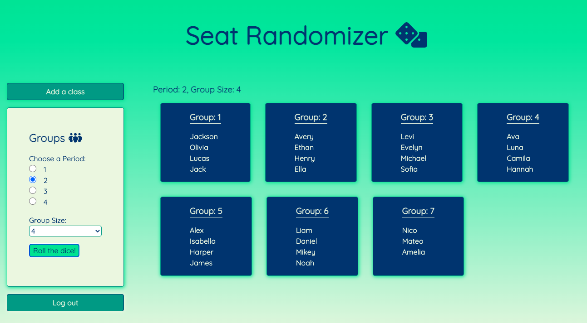

<!-- Improved compatibility of back to top link: See: https://github.com/othneildrew/Best-README-Template/pull/73 -->
<a name="readme-top"></a>
<!--
*** Thanks for checking out the Best-README-Template. If you have a suggestion
*** that would make this better, please fork the repo and create a pull request
*** or simply open an issue with the tag "enhancement".
*** Don't forget to give the project a star!
*** Thanks again! Now go create something AMAZING! :D
-->


<!-- PROJECT SHIELDS -->
<!--
*** I'm using markdown "reference style" links for readability.
*** Reference links are enclosed in brackets [ ] instead of parentheses ( ).
*** See the bottom of this document for the declaration of the reference variables
*** for contributors-url, forks-url, etc. This is an optional, concise syntax you may use.
*** https://www.markdownguide.org/basic-syntax/#reference-style-links
-->
<!-- [![Contributors][contributors-shield]][contributors-url]
[![Forks][forks-shield]][forks-url]
[![Stargazers][stars-shield]][stars-url]
[![Issues][issues-shield]][issues-url] -->
<!-- [![MIT License][license-shield]][license-url]
[![LinkedIn][linkedin-shield]][linkedin-url] -->


<!-- PROJECT LOGO -->
<br />
<div align="center">
  <a href="https://github.com/hannahmcdowell/seating-randomizer">
    
  </a>

  <p align="center">
    A tool for generating random seating charts
    <br />
    <a href="https://github.com/hannahmcdowell/seating-randomizer"><strong>Explore the docs »</strong></a>
    <br />
    <br />
    <a href="https://github.com/hannahmcdowell/seating-randomizer/blob/main/assets/exampleScreen.png">View Demo</a>
    ·
    <a href="https://github.com/hannahmcdowell/seating-randomizer/issues">Report Bug</a>
    ·
    <a href="https://github.com/hannahmcdowell/seating-randomizer/issues">Request Feature</a>
  </p>
</div>


<!-- TABLE OF CONTENTS -->
<details>
  <summary>Table of Contents</summary>
  <ol>
    <li>
      <a href="#about-the-project">About The Project</a>
      <ul>
        <li><a href="#built-with">Built With</a></li>
      </ul>
    </li>
    <li><a href="#getting-started">Getting Started</a></li>
    <li><a href="#usage">Usage</a></li>
    <li><a href="#roadmap">Roadmap</a></li>
    <li><a href="#contributing">Contributing</a></li>
    <li><a href="#license">License</a></li>
    <li><a href="#contact">Contact</a></li>
    <li><a href="#acknowledgments">Acknowledgments</a></li>
  </ol>
</details>


<!-- ABOUT THE PROJECT -->
## About The Project

A simple tool for teachers to generate random seating charts for all class periods. Enter your rosters, select a period, choose a group size and then roll the 🎲 to generate your seating chart for the day! Display on your projector and you're good to go.

<p align="right">(<a href="#readme-top">back to top</a>)</p>


### Built With

* [![React][React.js]][React-url]
* [![Node][Node.js]][Node-url]
* [![Express][Express.js]][Express-url]
* [![MongoDB][MongoDB]][MongoDB-url]

<p align="right">(<a href="#readme-top">back to top</a>)</p>


<!-- GETTING STARTED -->
## Getting Started

To get a local copy up and running follow these simple steps.

1. Get a MongoDB URI from [MongoDB Atlas](https://www.mongodb.com/atlas/database?tck=docs_server)
2. Clone the repo
   ```sh
   git clone https://github.com/hannahmcdowell/seating-randomizer.git
   ```
3. Install NPM packages
   ```sh
   npm install
   ```
4. Enter your MongoDB URI in `.env` 
   ```js
   const MONGO_URI = **************;
   ```

<p align="right">(<a href="#readme-top">back to top</a>)</p>


<!-- USAGE EXAMPLES -->
## Usage

1. Create an account.
2. Sign in.
3. Add a class roster.
4. Make a random seating chart!

<br />
<div align="center">
  <a href="https://github.com/hannahmcdowell/seating-randomizer">
    
  </a>
</div>


<p align="right">(<a href="#readme-top">back to top</a>)</p>


<!-- ROADMAP -->
## Roadmap

- Ability to temporarily remove students from the seating chart if absent
- Teachers should be able to update rosters
- Enable teachers to identify students who don't work well together and the algorithm will reduce the probability that they are put into a group

See the [open issues](https://github.com/hannahmcdowell/seating-randomizer/issues) for a full list of proposed features (and known issues).

<p align="right">(<a href="#readme-top">back to top</a>)</p>


<!-- CONTRIBUTING -->
## Contributing

Contributions are what make the open source community such an amazing place to learn, inspire, and create. Any contributions you make are **greatly appreciated**.

If you have a suggestion that would make this better, please fork the repo and create a pull request. You can also simply open an issue with the tag "enhancement".
Don't forget to give the project a star! Thanks again!

1. Fork the Project
2. Create your Feature Branch (`git checkout -b feature/AmazingFeature`)
3. Commit your Changes (`git commit -m 'Add some AmazingFeature'`)
4. Push to the Branch (`git push origin feature/AmazingFeature`)
5. Open a Pull Request

<p align="right">(<a href="#readme-top">back to top</a>)</p>


<!-- LICENSE -->
## License

Distributed under the [MIT](https://opensource.org/licenses/MIT) License. 

<p align="right">(<a href="#readme-top">back to top</a>)</p>


<!-- CONTACT -->
## Contact

Hannah McDowell - [LinkedIn](https://www.linkedin.com/in/hannah-lisbeth-mcdowell/)

Project Link: [https://github.com/hannahmcdowell/seating-randomizer](https://github.com/hannahmcdowell/seating-randomizer)

<p align="right">(<a href="#readme-top">back to top</a>)</p>


<!-- ACKNOWLEDGMENTS -->
## Acknowledgments

* Thanks to [https://github.com/Envoy-VC/awesome-badges](https://github.com/Envoy-VC/awesome-badges) for the Awesome Badges
* Thanks to [https://github.com/othneildrew/Best-README-Template](https://github.com/othneildrew/Best-README-Template) for the best README template


<p align="right">(<a href="#readme-top">back to top</a>)</p>


<!-- MARKDOWN LINKS & IMAGES -->
<!-- https://www.markdownguide.org/basic-syntax/#reference-style-links -->
[contributors-shield]: https://img.shields.io/github/contributors/hannahmcdowell/seating-randomizer.svg?style=for-the-badge
[contributors-url]: https://github.com/hannahmcdowell/seating-randomizer/graphs/contributors
[forks-shield]: https://img.shields.io/github/forks/github_username/repo_name.svg?style=for-the-badge
[forks-url]: https://github.com/github_username/repo_name/network/members
[stars-shield]: https://img.shields.io/github/stars/github_username/repo_name.svg?style=for-the-badge
[stars-url]: https://github.com/github_username/repo_name/stargazers
[issues-shield]: https://img.shields.io/github/issues/github_username/repo_name.svg?style=for-the-badge
[issues-url]: https://github.com/github_username/repo_name/issues
[license-shield]: https://img.shields.io/github/license/hannahmcdowell/seating-randomizer.svg?style=for-the-badge
[license-url]: https://opensource.org/licenses/MIT
[linkedin-shield]: https://img.shields.io/badge/-LinkedIn-black.svg?style=for-the-badge&logo=linkedin&colorB=555
[linkedin-url]: https://www.linkedin.com/in/hannah-lisbeth-mcdowell
[product-screenshot]: images/screenshot.png
[Next.js]: https://img.shields.io/badge/next.js-000000?style=for-the-badge&logo=nextdotjs&logoColor=white
[Next-url]: https://nextjs.org/
[React.js]: https://img.shields.io/badge/React-20232A?style=for-the-badge&logo=react&logoColor=61DAFB
[React-url]: https://reactjs.org/
[Vue.js]: https://img.shields.io/badge/Vue.js-35495E?style=for-the-badge&logo=vuedotjs&logoColor=4FC08D
[Vue-url]: https://vuejs.org/
[Angular.io]: https://img.shields.io/badge/Angular-DD0031?style=for-the-badge&logo=angular&logoColor=white
[Angular-url]: https://angular.io/
[Svelte.dev]: https://img.shields.io/badge/Svelte-4A4A55?style=for-the-badge&logo=svelte&logoColor=FF3E00
[Svelte-url]: https://svelte.dev/
[Laravel.com]: https://img.shields.io/badge/Laravel-FF2D20?style=for-the-badge&logo=laravel&logoColor=white
[Laravel-url]: https://laravel.com
[Bootstrap.com]: https://img.shields.io/badge/Bootstrap-563D7C?style=for-the-badge&logo=bootstrap&logoColor=white
[Bootstrap-url]: https://getbootstrap.com
[JQuery.com]: https://img.shields.io/badge/jQuery-0769AD?style=for-the-badge&logo=jquery&logoColor=white
[JQuery-url]: https://jquery.com 
[Node-url]: https://nodejs.org/en/
[Node.js]: https://img.shields.io/badge/Node.js-43853D?style=for-the-badge&logo=node.js&logoColor=white
[MongoDB-url]: https://www.mongodb.com/
[MongoDB]: https://img.shields.io/badge/MongoDB-4EA94B?style=for-the-badge&logo=mongodb&logoColor=white
[Express-url]: https://expressjs.com/
[Express.js]: https://img.shields.io/badge/Express.js-404D59?style=for-the-badge

